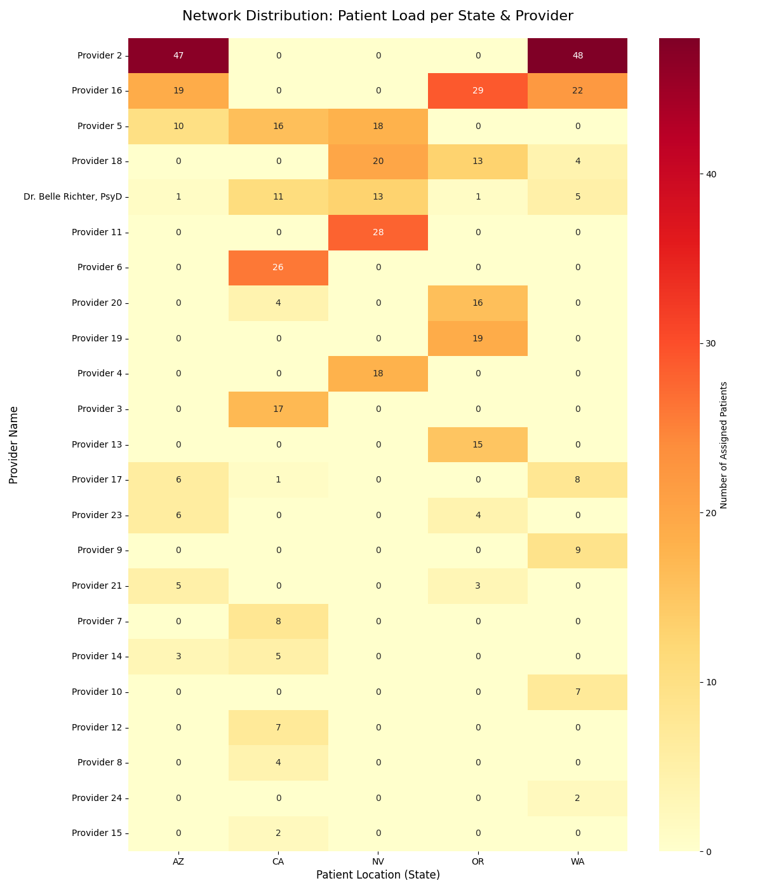

Enterprise Clinical Operations & Network Resiliency Suite

The Problem

In high-growth telehealth, scaling isn't just about hiring more therapists—it's about navigating State Licensing, Insurance Credentialing, and Clinical Specialty. Without a data-driven approach, organizations often face "Clinical Deserts" where patients have zero match options, or "Single Points of Failure" where an entire state's revenue rests on one over-utilized provider.

The Solution

I developed a four-stage Python suite that simulates an enterprise-level clinical network (500+ patients) and automates the complex logic required to balance provider workload while maintaining 100% regulatory and clinical compliance.

The Tech Stack

Python (Pandas): For high-volume data transformation and matching logic.

Seaborn & Matplotlib: For advanced operational heatmaps and density visuals.

Operational Strategy Logic: Tiered capacity thresholds (80/90/100) for proactive recruitment.

Key Features

1. The Smart-Match Compliance Engine
Unlike simple scheduling tools, this engine enforces Hard Constraints (State Licensing & Insurance) before calculating Clinical Fit (Specialty Intersections).

Output: A ranked "Top 3" recommendation list for every patient, providing Care Coordinators with immediate backups if a primary provider is unavailable.

2. Provider Burnout & Payer Density Heatmaps
Visualizes the network's health to identify localized "Red Zones."

Network Distribution: Maps patient load across state lines to find regional bottlenecks.

Insurance Density: Identifies "Single Points of Failure" where one therapist is carrying the entire load for a specific insurance contract (e.g., Kaiser in WA).

3. Proactive Capacity Strategy
Implemented an industry-standard 80/90/100 Threshold system:

80% (Warning): Triggers the 90-day recruitment and credentialing cycle.

90% (Critical): Halts all new intakes to protect provider retention.

100% (Burnout): Initiates automated "Workload Shifting" to valid clinical alternatives.

4. Network Resiliency & Recruitment Roadmap
The "Brain" of the suite. It scans the entire database to find Single Points of Failure (SPF)—patients who have only one legal/clinical match option in the system.

Impact: Generates a prioritized "Hiring Shopping List" for Talent Acquisition, detailing the exact State + Insurance + Specialty profile needed to de-risk the network.

Business Impact

Revenue Protection: Identifies "Unmatched" patients (Clinical Deserts) to calculate potential revenue loss and justify headcount.

Provider Retention: Prevents turnover by automating load-balancing and flagging burnout before it happens.

Regulatory Safety: Hard-coded state licensing checks ensure 100% compliance with telehealth laws.

